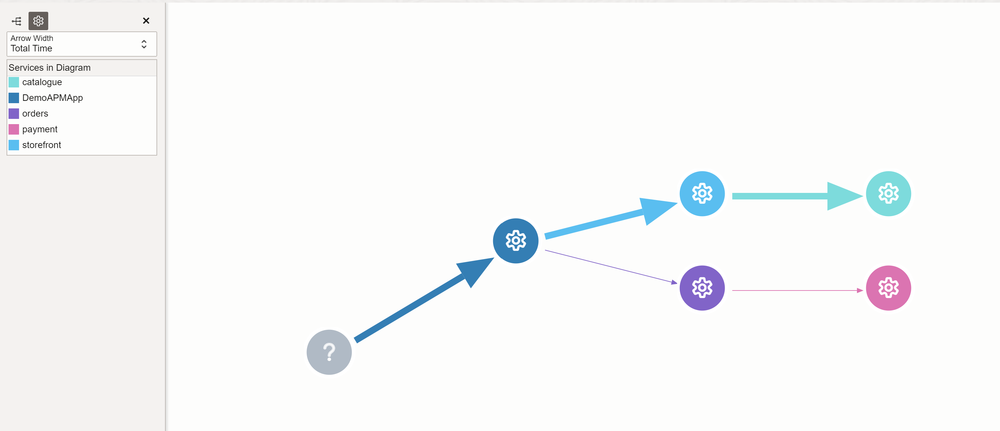
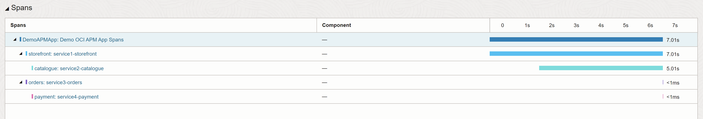

# OCI APM Test

Silly little test. It is highly inspired and copied from this [blog](https://blogs.oracle.com/observability/post/oci-apm-python-tracing-v2).
In contrast to the original blog this test uses environment variables for the APM configuration.
Install requirements:

__Note__:Recommended to use a virtual environment
```shell
pip install -r requirenments.txt
```

Set your environment and replace it with your configuration, see also 
[OCI documentation](https://docs.oracle.com/en/cloud/paas/application-performance-monitoring/apmpy/#step_three)
```shell
export APM_ENDPOINT="https://xxx.apm-agt.eu-frankfurt-1.oci.oraclecloud.com"
export APM_PUBLICKEY="YOUR_PUBLIC_KEY"
```

Start the flaskserver:

```shell
python3 oci-apm.py
```

In another shell call the web application:

```shell
curl http://127.0.0.1:5000/tracing
```
In the OCI console you should see the topology and your spans

